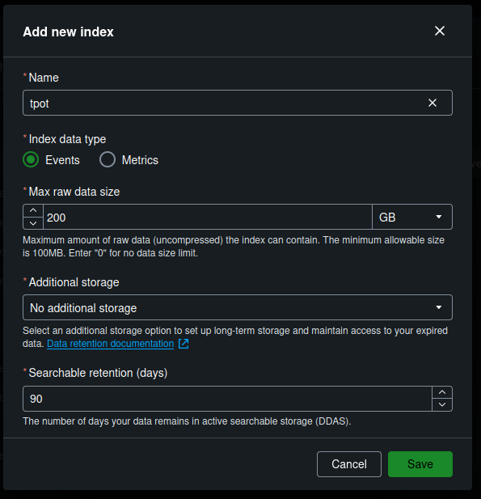
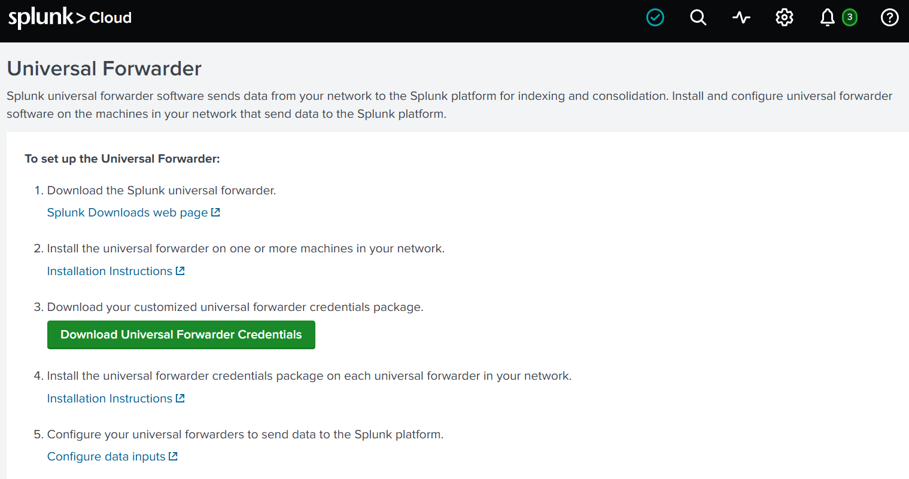
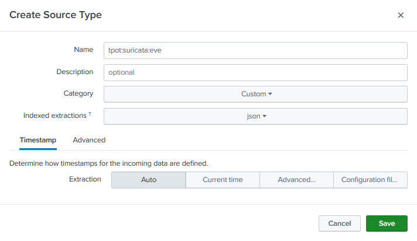
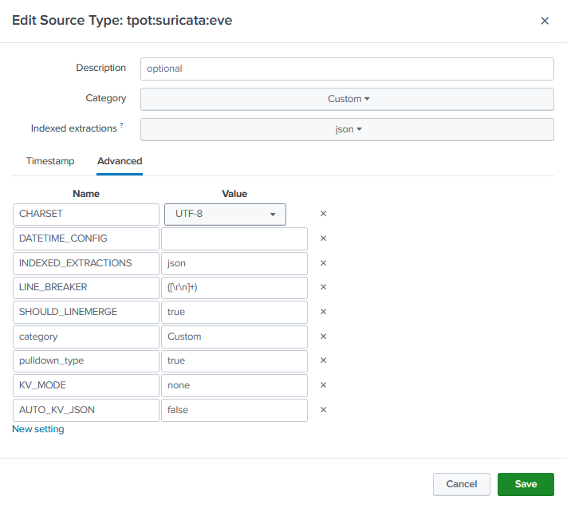

A quick guide for deploying [T-Pot](https://github.com/telekom-security/tpotce) on Azure for fun.

## What is T-Pot?
---
T-Pot is an open-source multi-honeypot platform developed and maintained by Telekom Security (Deutsche Telekom). It supports multiple architectures and operating systems and bundles 30+ well-known honeypots (Cowrie, Dionaea, Tanner, Conpot, etc.) together, each emulating a different service/application (file shares, SSH, databases, web apps, ICS/SCADA). These honeypots are deployed and managed as individual containers on a single host via Docker Compose. All captured activity is processed by the ELK stack (Elasticsearch, Logstash, Kibana) where Logstash ingests events, Elasticsearch stores them, and Kibana provides web dashboards for visualizing and analyzing captured attacks.

## Azure VM Deployment 
---
A quick guide for deploying T-Pot on Azure for fun.

Create a resource > select `Ubuntu Server 24.04 LTS` or `Debian 12 "Bookworm"`
- **Note:** Ubuntu was less "problematic", Debian was slightly (negligible) more performant. I went with Debian for this tutorial, but most steps should apply to both.

[](create-vm1.png)

[](create-vm2.png)

#### Basics

    Virtual Machine Name:    tpot
    Region:                  East US 2
    Availibility Zone:       1
    Image:                   Debian 12 "Bookworm" - Gen2
    VM architecture:         x64
    Size:                    Standard B4ms (4 vcpus, 16 GiB memory)
    Authentication type:     SSH public key
    Public inbound ports:    none

[](basics.png)

- **Note:** To save costs, it may be possible to run T-Pot on 2 cores, 8GB RAM - though this would require tweaking Logstash/Elasticsearch (A T-Pot Hive install on a fresh server idles around 7.9-8.5 GB RAM usage).

[](basics2.png)

- **Note:** You can allow immediate remote access via port 22 during this setup, but this port will be exposed to ALL external IPs. For this reason, I suggest setting 'Public inbound ports' to None and then creating a more restricted, temporary NSG rule after deploying the VM (see [Install step #1](#installing-t-pot)).

[](basics3.png)
- **Note:** You can select 'Generate new key pair' here if you want to use a new SSH key for accessing this VM. Put this key in your local .ssh folder. If on *nix, you may need to restrict its permissions with `sudo chmod 400 {generated key name}.pem`

#### Disks

    OS Disk size:      128 GiB
    OS Disk type:      Standard SSD LRS
    Delete with VM:    Enabled

[](disks.png)

- **Note:** Though the [offical documentation](https://github.com/telekom-security/tpotce?tab=readme-ov-file#system-requirements) says SSD storage is required, I found this to work fine on Standard HDD.

#### Networking

    Virtual network:            tpot-vnet
    Subnet: default             (10.0.0.0/24)
    Public IP:                  tpot-ip
    Accelerated networking:     On
    Delete with VM:             Enabled

[](networking.png)

- **Note:** T-Pot expects your virtual network subnet (internal) to be a /24 (255.255.255.0) 


## Installing T-Pot 
---

1. Create temporary SSH firewall rule (VM > Side Panel > Networking > Settings > (+) Create Port Rule > Inbound)

[](nsg1.png)

[](ssh-rule.png)

3. SSH into the VM
4. As non-root, `cd $HOME` and run the following command ([please verify this has not changed](https://github.com/telekom-security/tpotce#tldr)):

       env bash -c "$(curl -sL https://github.com/telekom-security/tpotce/raw/master/install.sh)"

[](install1.png)

- **Note:** If unattended-upgrades.service is running (check with `sudo systemctl status unattended-upgrades.service`), you may need to stop it temporarily to avoid 'dpkg frontend lock' errors: `sudo systemctl stop unattended-upgrades.service`

<br>

#### During install:
- T-Pot install type: 'h'

[](install2.png)

- Document your chosen web username/password. You will need this to login to the T-Pot Web Dashboard.
- Even though Azure NSG rules restrict access, make sure to have a strong web user password (e.g. 30+ char alhpa-numeric).


## System Tweaks
---

    $ nano /etc/ssh/sshd_config
    change: PasswordAuthentication {} --> PasswordAuthentication no

    $ sudo apt install unattended-upgrades
    $ sudo systemctl enable --now unattended-upgrades.service
    
    $ sudo crontab -e
    # cleanup
    0 2 * * 0 apt autoremove --purge && apt autoclean -y

    (if your VM has exim4 installed, it will compete with some of the honeypots for port 25)
    $ sudo systemctl disable --now exim4-base.timer exim4-base.service exim4.service
    $ sudo apt purge exim4*


## NSG Firewall Rules
---

- Delete the temporary SSH rule created for initial access

#### Inbound:
[](mgmt-nsg.png)

    Source: My IP address
    Source IP addresses/CIDR ranges: {your public IP}
    Source port ranges: *
    Destination: Any
    Service: Custom
    Destination port ranges: 64294, 64295, 64297
    Protocol: Any
    Action: Allow
    Priority: 100
    Name: Allow-TpotMgmt-Inbound
    Description: Allow SSH and Web Dashboard access from My IP.

[](honeypot-nsg.png)

    Source: My IP address
    Source IP addresses/CIDR ranges: {your public IP}
    Source port ranges: *
    Destination: Any
    Service: Custom
    Destination port ranges: 19,21,22,23,25,42,53,69,80,102,110,123,135,143,161,389,443,445,502,623,631,993,995,1025,1080,1433,1521,1723,1883,1900,2404,2575,3000,3306,3389,5000,5060,5432,5555,5900,6379,6667,8080,8081,8090,8443,9100,9200,10001,11112,11211,25565,44818,47808,50100
    Protocol: Any
    Action: Allow
    Priority: 110
    Name: Allow-BadTraffic-Inbound
    Description: Expose honeypot ports to the internet.

#### Outbound:

[](nsg-outbound.png)

    Source: Any
    Source port ranges: *
    Destination: Any
    Service: Custom
    Destination port ranges: 80, 443, 11434
    Protocol: Any
    Action: Allow
    Priority: 120
    Name: Allow-TpotMgmt-Outbound
    Description: Allow outbound management traffic.


## Test Access
---

**SSH:** `ssh {username}@{Azure VM Public IP} -p 64295` or
`ssh {username}@{Azure VM Public IP} -i ~/.ssh/{generated key name}.pem -p 64295` if you're using a new key.

**Web Dashboard:** `https://{Azure VM Public IP}:64297` (bookmark this)

[](tpot-dash.png)

#### Kibana

[](kibana-dash.png)

#### Attack Map

[](attack-map.png)


#### [SpiderFoot](https://github.com/smicallef/spiderfoot) Threat Intelligence

[](spiderfoot1.png)

[](spiderfoot2.png)


## Administration
---
#### File Transfer

- Upload to T-Pot server

      scp -i {key name} -P 64295 -r {file or folder to upload} {T-Pot username}{<server IP}:{remote target path}

- Download from T-Pot server

      scp -i {key name} -P 64295 -r {T-Pot username}@{server IP}:{file or folder to download} {local target path}

- Verify that the file/folder to be downloaded has group (tpot) read access:

      chmod g+r /home/csadmin/tpotce/data/dionaea/binaries/*

#### Creating New Web Users

Option 1
- `/home/<local user>/tpotce/genuser.sh`
- `htpasswd /home/<local user>/tpotce/data/nginx/conf/nginxpasswd <new user>`
- Verify: `cat /home/<local user>/tpotce/data/nginx/conf/nginxpasswd` to make sure there is an entry for `<new user>`

Option 2
1. `htpasswd -n -b 'username' 'password' | base64 -w0` - This will output a base64 string that should be pasted into ~/tpotce/.env for permanent web users 
2. `vi ~/tpotce/.env`
3. Edit WEB_USER={base64 string here}
4. If there are multiple web users separate b64 strings with a space: WEB_USER={base64 string} {base64 string}

**Note:** For some reason, Option 1 would not create permanent web users (resets after scheduled tpot.service restart)

**Note:** All created users will have admin/edit privileges on the Kibana dashboard. If desired, a separate Elastic instance can be connected to T-Pot for more custom authorization.

#### Changing the T-Pot Web UI Password:
- `htpasswd /home/<local user>/tpotce/data/nginx/conf/nginxpasswd <web username>`
- Verify: `htpasswd -v /home/<local user>/tpotce/data/nginx/conf/nginxpasswd <web username>`


## GreedyBear IOC Feed Generation
---
Documentation: https://github.com/GreedyBear-Project/GreedyBear
Example Feed/Dashboard: https://greedybear.honeynet.org/

#### Installation

1. `cd ~ && git clone https://github.com/GreedyBear-Project/GreedyBear.git`

Initialize GreedyBear. This process checks system requirements, installs the required packages, checks out the appropriate git branch, and generates environment files:

1. `cd GreedyBear/ && ./gbctl init --elastic-endpoint http://172.17.0.1:64300`

#### **Configuration**

1. `nano ~/GreedyBear/docker/default.yml`

Change nginx docker port mapping to `64300:80` :

```
nginx:
    image: intelowlproject/greedybear_nginx:prod
    container_name: greedybear_nginx
    restart: unless-stopped
    volumes:
      - ../configuration/nginx/http.conf:/etc/nginx/conf.d/default.conf
      - ../configuration/nginx/errors.conf:/etc/nginx/errors.conf
      - ../configuration/nginx/locations.conf:/etc/nginx/locations.conf
      - nginx_logs:/var/log/nginx
      - static_content:/var/www/static
      - gunicorn_sockets:/run/gunicorn
    ports:
      - "64300:80"
```

**Start and Check Status**

`./gbctl up` , `./gbctl health`, `./gbctl logs`

**Access**

1. Create admin account for web dashboard

 `./gbctl create-admin --username admin --password {password}`

1. https://{Azure VM Public IP}:64300

**Useful Commands**

`./gbctl logs`  - all GreedyBear container logs

`./gbctl logs app`  - Django (WebUI) app logs

`./gbctl down`  - stop everything

`./gbctl restart`  - restart

`./gbctl update` - update to latest version


## Splunk Cloud Integration
---
#### Creating the Index

1. Splunk Cloud > Settings > Indexes > New Index

[](splunk-1.png)

#### Configuring the Universal Forwarder

[](splunk-2.png)

1. Download Splunk Universal Forwarder (https://www.splunk.com/en_us/download/universal-forwarder.html)
2. Install/Configure UF:
    
    ```
    sudo dpkg -i splunkforwarder-*-linux-amd64.deb
    
    sudo /opt/splunkforwarder/bin/splunk enable boot-start -user root --accept-license
    
    sudo usermod -aG splunkfwd $USER
    newgrp splunkfwd
    
    systemctl status SplunkForwarder.service
    ```
    
3. Download [Universal Forwarder Credentials](https://help.splunk.com/en/splunk-enterprise/forward-and-process-data/universal-forwarder-manual/9.0/configure-the-universal-forwarder/install-and-configure-the-splunk-cloud-platform-universal-forwarder-credentials-package) package: 
- NOTE: It is easier to just download from an actual browser and then move **splunkclouduf.spl** to T-Pot via scp.

```
sudo /opt/splunkforwarder/bin/splunk install app ./splunkclouduf.spl -auth admin:{forwarder_admin_pass}

sudo /opt/splunkforwarder/bin/splunk restart

# check for active forwarders
sudo /opt/splunkforwarder/bin/splunk list forward-server

# confirm
sudo cat /opt/splunkforwarder/etc/apps/100_xxx_splunkcloud/local/outputs.conf
```

4. Forwarder configuration and refining for high fidelity alerts

**inputs.conf (/opt/splunkforwarder/etc/system/local/inputs.conf)**

```
[monitor:///home/{user}/tpotce/data/suricata/log/eve.json]
sourcetype = tpot:suricata:eve
index = tpot
ignoreOlderThan = 2d
crcSalt = <SOURCE>

[monitor:///home/{user}/tpotce/data/cowrie/log/cowrie.json]
sourcetype = cowrie
index = tpot
ignoreOlderThan = 2d
crcSalt = <SOURCE>

[monitor:///home/{user}/tpotce/data/dionaea/log/dionaea.json]
sourcetype = dionaea
index = tpot
ignoreOlderThan = 2d
crcSalt = <SOURCE>

[monitor:///home/{user}/tpotce/data/tanner/log/tanner_report.json]
sourcetype = tanner
index = tpot
ignoreOlderThan = 2d
crcSalt = <SOURCE>

[monitor:///home/{user}/tpotce/data/h0neytr4p/log/log.json]
sourcetype = h0neytr4p
index = tpot
ignoreOlderThan = 2d
crcSalt = <SOURCE>
```

**transforms.conf (/opt/splunkforwarder/etc/system/local/transforms.conf)**

```
# 1. Drop everything that isn't an alert (flow, dns, tls, http, fileinfo, etc.)
[suricata_drop_non_alerts]
REGEX = ^(?!.*"event_type":"alert").*
DEST_KEY = queue
FORMAT = nullQueue

# 2. Drop Suricata stream-engine noise (signature_id 2210000-2210999)
[suricata_drop_stream_events]
REGEX = "signature_id":2210\d{3}\b
DEST_KEY = queue
FORMAT = nullQueue

# 3. Drop anything not flagged High confidence
[suricata_drop_low_confidence]
REGEX = ^(?!.*"confidence":\["High"\]).*
DEST_KEY = queue
FORMAT = nullQueue

# 4. Drop alerts that captured no printable payload
[suricata_drop_no_payload]
REGEX = ^(?!.*"payload_printable":).*
DEST_KEY = queue
FORMAT = nullQueue

# 5. Drop low signature_severity (keep Major and Critical)
[suricata_drop_low_severity]
REGEX = "signature_severity":\["(?:Unknown|Informational|Minor)"\]
DEST_KEY = queue
FORMAT = nullQueue
```

**props.conf (/opt/splunkforwarder/etc/system/local/props.conf)**

```
[tpot:suricata:eve]
LINE_BREAKER = ([\r\n]+)
SHOULD_LINEMERGE = false
TRUNCATE = 1000000
NO_BINARY_CHECK = true
force_local_processing = true
TRANSFORMS-filter = suricata_drop_non_alerts, suricata_drop_stream_events, suricata_drop_low_confidence, suricata_drop_no_payload, suricata_drop_low_severity

[cowrie]
LINE_BREAKER = ([\r\n]+)
SHOULD_LINEMERGE = false
TRUNCATE = 100000
force_local_processing = true
NO_BINARY_CHECK = true

[dionaea]
LINE_BREAKER = ([\r\n]+)
SHOULD_LINEMERGE = false
TRUNCATE = 100000
force_local_processing = true
NO_BINARY_CHECK = true

[tanner]
LINE_BREAKER = ([\r\n]+)
SHOULD_LINEMERGE = false
TRUNCATE = 100000
force_local_processing = true
NO_BINARY_CHECK = true

[h0neytr4p]
LINE_BREAKER = ([\r\n]+)
SHOULD_LINEMERGE = false
TRUNCATE = 100000
force_local_processing = true
NO_BINARY_CHECK = true
```

#### Creating Source Type

1. Settings > **Source types >** New Source Type
2. Indexed extractions = json

[](splunk-3.png)

3. Advanced > KV_MODE = ‘none’, AUTO_KV_JSON = ‘false’

[](splunk-4.png)


## [OpenCTI](https://github.com/OpenCTI-Platform/opencti) Threat Intelligence Correlation
---
...


## Troubleshooting
---
#### To check for TPot-related errors:
- `journalctl -u tpot -f`
- `sudo systemctl status tpot.service`  

#### To check for port bind conflicts that will force-restart tpot.service:
- `sudo netstat -tulpen` or `sudo ss -tunlap` 

#### To determine processes reponsible for port conflicts on a specified port:
- `sudo fuser {port}/tcp(udp)` to get the PID(s) of processes using this port, then `ps -p {PID}`

#### You may need to manually set DNS/nameservers in case of port 53 conflict: 
        
    sudo systemctl disable --now systemd-resolved.service
    
    sudo nano /etc/resolve.conf
    
    ---
    127.0.0.1 {hostname}
    nameserver 8.8.8.8
    nameserver 8.8.4.4
